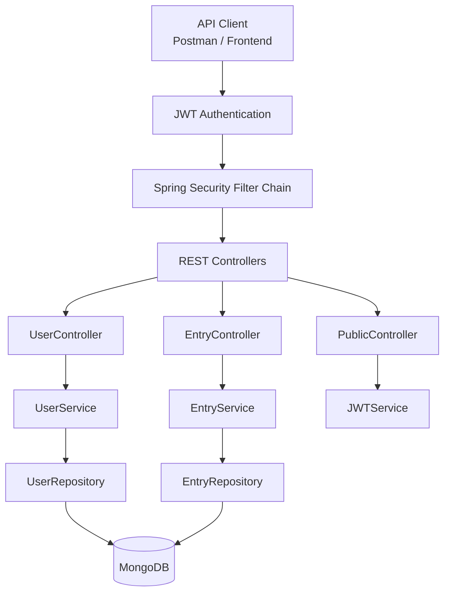
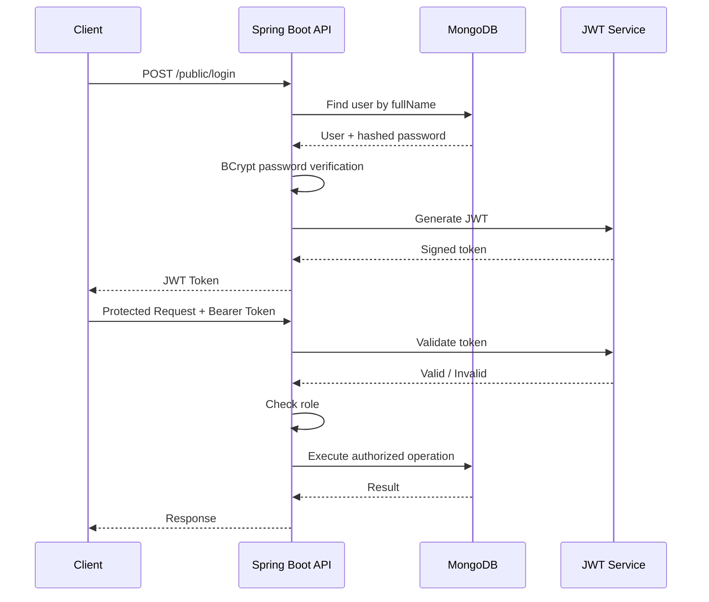

# 🚀 Jira Issue & Team Management API

<div align="center">

**A role-based Jira-style issue management backend built with Spring Boot, MongoDB, Spring Security and JWT.**

[](https://www.oracle.com/java/)
[](https://spring.io/projects/spring-boot)
[](https://www.mongodb.com/)
[](https://spring.io/projects/spring-security)
[](https://jwt.io/)
[](https://maven.apache.org/)
[](https://www.docker.com/)

</div>

---

## 📌 Table of Contents

- [✨ Project Overview](#-project-overview)
- [🎯 What This Project Does](#-what-this-project-does)
- [🔥 Features](#-features)
- [🧩 Tech Stack](#-tech-stack)
- [🏗️ Architecture](#️-architecture)
- [👥 Role & Permission System](#-role--permission-system)
- [📂 Project Structure](#-project-structure)
- [🔐 Authentication Flow](#-authentication-flow)
- [🗄️ Data Model](#️-data-model)
- [🔌 API Documentation](#-api-documentation)
- [⚙️ Environment Variables](#️-environment-variables)
- [🚀 Getting Started](#-getting-started)
- [🐳 Docker](#-docker)
- [🧪 Testing the API](#-testing-the-api)
- [🛡️ Security](#️-security)
- [💡 Example Request Flow](#-example-request-flow)
- [🔮 Future Improvements](#-future-improvements)
- [👨‍💻 Author](#-author)

---

## ✨ Project Overview

This project is a **Jira-inspired issue and team management REST API** designed around real-world software development workflows.

It allows teams to manage two types of work items:

- 🐞 **Bugs** — created by testers
- 📖 **Stories** — created by developers

The application also provides **role-based access control**, allowing administrators and managers to perform management operations while developers and testers work with the issues relevant to their responsibilities.

Authentication is implemented using **JWT**, passwords are stored using **BCrypt hashing**, and application data is persisted in **MongoDB**.

> 💡 The project is currently structured primarily as a **Spring Boot REST backend/API**. The uploaded project does not contain a separate React/Angular frontend.

---

## 🎯 What This Project Does

### For Administrators 👑

Administrators can:

- Create admin accounts
- Create manager accounts
- Create developer accounts
- Create tester accounts
- Update users
- Delete users
- Manage the overall team structure

### For Managers 🧑‍💼

Managers can:

- View all users
- View all issues
- View only bugs
- View only stories
- View issues belonging to a particular user

### For Developers 👨‍💻

Developers can:

- Create stories
- View their own assigned issues
- View an individual issue
- Update their own issues
- Delete their own issues

### For Testers 🧪

Testers can:

- Create bugs
- View their own assigned issues
- View an individual issue
- Update their own issues
- Delete their own issues

---

## 🔥 Features

| Feature | Description |
|---|---|
| 🔐 JWT Authentication | Stateless token-based authentication |
| 🛡️ Role-Based Authorization | Different permissions for ADMIN, MANAGER, DEVELOPER and TESTER |
| 🔑 BCrypt Password Hashing | Passwords are never stored as plain text |
| 🐞 Bug Management | Testers can create bugs |
| 📖 Story Management | Developers can create stories |
| ✏️ Issue Update | Users can update their own issues |
| 🗑️ Issue Delete | Users can delete their own issues |
| 🔎 Issue Filtering | Managers can retrieve bugs and stories separately |
| 👥 User Management | Admins can create, update and delete users |
| 📊 User Issue Tracking | Users maintain references to their assigned entries |
| 🍃 MongoDB Persistence | MongoDB stores users and issues |
| 🐳 Docker Support | Multi-stage Dockerfile included |
| 📦 Maven Build | Standard Maven/Spring Boot project structure |
| ⚡ Stateless Security | No server-side login sessions |

---

## 🧩 Tech Stack

### Backend

- **Java 17**
- **Spring Boot**
- **Spring Web**
- **Spring Data MongoDB**
- **Spring Security**
- **JWT / JJWT 0.13.0**
- **Lombok**
- **Maven**

### Database

- **MongoDB**

### Deployment / DevOps

- **Docker**
- Environment-variable based configuration

---

## 🏗️ Architecture



### Request Flow

```text
Client
  │
  │ HTTP Request
  ▼
JWT Filter
  │
  │ Validate Bearer Token
  ▼
Spring Security
  │
  │ Check Role / Permission
  ▼
Controller
  │
  ▼
Service Layer
  │
  ▼
Repository Layer
  │
  ▼
MongoDB
```

---

## 👥 Role & Permission System

The application defines four roles:

```text
ADMIN
  │
  ▼
MANAGER
  ├──────────────► TESTER
  └──────────────► DEVELOPER
```

The configured Spring Security role hierarchy is:

```text
ADMIN > MANAGER
MANAGER > TESTER
MANAGER > DEVELOPER
```

This means a higher-level role inherits permissions from the role below it.

### Permission Matrix

| Operation | ADMIN | MANAGER | DEVELOPER | TESTER |
|---|:---:|:---:|:---:|:---:|
| Create Admin | ✅ | ❌ | ❌ | ❌ |
| Create Manager | ✅ | ❌ | ❌ | ❌ |
| Create Developer | ✅ | ❌ | ❌ | ❌ |
| Create Tester | ✅ | ❌ | ❌ | ❌ |
| Update User | ✅ | ❌ | ❌ | ❌ |
| Delete User | ✅ | ❌ | ❌ | ❌ |
| View All Users | ✅* | ✅ | ❌ | ❌ |
| View All Issues | ✅* | ✅ | ❌ | ❌ |
| View Bugs | ✅* | ✅ | ❌ | ❌ |
| View Stories | ✅* | ✅ | ❌ | ❌ |
| Create Story | ❌ | ❌ | ✅ | ❌ |
| Create Bug | ❌ | ❌ | ❌ | ✅ |
| View Own Issues | ✅ | ✅ | ✅ | ✅ |
| Update Own Issue | ✅ | ✅ | ✅ | ✅ |
| Delete Own Issue | ✅ | ✅ | ✅ | ✅ |

`*` Admin inherits manager-level permissions through the configured role hierarchy.

> Note: The application enforces permissions through both the security filter chain and method-level `@PreAuthorize` annotations.

---

## 📂 Project Structure

```text
jira-app-master/
│
├── src/
│   ├── main/
│   │   ├── java/com/testApp/jira/
│   │   │
│   │   ├── config/
│   │   │   ├── JWTAuthFilter.java
│   │   │   └── SpringSecurity.java
│   │   │
│   │   ├── controllers/
│   │   │   ├── EntryController.java
│   │   │   ├── PublicController.java
│   │   │   └── UserController.java
│   │   │
│   │   ├── entities/
│   │   │   ├── Entry.java
│   │   │   ├── EntryType.java
│   │   │   ├── Role.java
│   │   │   └── User.java
│   │   │
│   │   ├── repositories/
│   │   │   ├── EntryRepository.java
│   │   │   └── UserRepository.java
│   │   │
│   │   ├── services/
│   │   │   ├── EntryService.java
│   │   │   ├── JWTService.java
│   │   │   ├── UserDetailsServicesImpl.java
│   │   │   └── UserService.java
│   │   │
│   │   └── resources/
│   │       ├── application.properties
│   │       └── static/index.html
│   │
│   └── test/
│       └── java/com/testApp/jira/
│           └── JiraApplicationTests.java
│
├── Dockerfile
├── pom.xml
├── mvnw
├── mvnw.cmd
└── package.json
```

---

## 🔐 Authentication Flow

The login endpoint validates the user's credentials and returns a JWT.



### Token Usage

After login, send the returned token with protected requests:

```http
Authorization: Bearer <YOUR_JWT_TOKEN>
```

The JWT currently contains:

- Username / subject
- Role claim
- Issued-at timestamp
- Expiration timestamp

The configured token lifetime is **10 hours**.

---

## 🗄️ Data Model

### User

```text
User
├── id
├── fullName       [unique]
├── password       [BCrypt hashed]
├── role
└── entryList      [references Entry documents]
```

### Entry

```text
Entry
├── entryId
├── title
├── description
├── assignedTo
├── type           [BUG / STORY]
└── date
```

### MongoDB Collections

```text
jira
├── user
└── entry
```

---

# 🔌 API Documentation

Base URL:

```text
http://localhost:8080
```

## 🔑 Authentication

### Login

```http
POST /public/login
```

Example request:

```json
{
  "fullName": "john",
  "password": "password123"
}
```

Response:

```text
<JWT_TOKEN>
```

No authentication is required for this endpoint.

---

# 👤 User Management APIs

All user-management endpoints require authentication.

### Create Admin

```http
POST /user/new-admin
```

**Required role:** `ADMIN`

```json
{
  "fullName": "adminUser",
  "password": "password123"
}
```

---

### Create Manager

```http
POST /user/new-manager
```

**Required role:** `ADMIN`

---

### Create Developer

```http
POST /user/new-dev
```

**Required role:** `ADMIN`

---

### Create Tester

```http
POST /user/new-tester
```

**Required role:** `ADMIN`

---

### Get All Users

```http
GET /user/all-users
```

**Required role:** `MANAGER`

---

### Update User

```http
PUT /user/update-user/id/{id}
```

**Required role:** `ADMIN`

---

### Delete User

```http
DELETE /user/delete-user/id/{id}
```

**Required role:** `ADMIN`

---

# 🐞 Issue APIs

## Create Bug

```http
POST /entry/bug
```

**Required role:** `TESTER`

Example:

```json
{
  "title": "Login button not working",
  "description": "The login button does not submit the form."
}
```

The backend automatically sets:

```text
type       = BUG
assignedTo = authenticated user
date       = current date/time
```

---

## 📖 Create Story

```http
POST /entry/story
```

**Required role:** `DEVELOPER`

Example:

```json
{
  "title": "Add dark mode",
  "description": "Users should be able to switch between light and dark themes."
}
```

The backend automatically sets:

```text
type       = STORY
assignedTo = authenticated user
date       = current date/time
```

---

## 📋 Get All Issues

```http
GET /entry
```

**Required role:** `MANAGER`

---

## 🐞 Get All Bugs

```http
GET /entry/bug
```

**Required role:** `MANAGER`

---

## 📖 Get All Stories

```http
GET /entry/story
```

**Required role:** `MANAGER`

---

## 👤 Get Issues of a User

```http
GET /entry/user-entry/id/{userId}
```

**Required role:** `MANAGER`

---

## 👨‍💻 Get My Issues

```http
GET /entry/user-entry
```

Requires authentication.

---

## 🔎 Get Issue by ID

```http
GET /entry/id/{entryId}
```

Requires authentication.

The endpoint checks that the issue belongs to the authenticated user's issue list.

---

## ✏️ Update Issue

```http
PUT /entry/id/{entryId}
```

Requires authentication.

Example:

```json
{
  "title": "Updated issue title",
  "description": "Updated issue description"
}
```

The implementation updates the title and description while retaining existing values when appropriate.

---

## 🗑️ Delete Issue

```http
DELETE /entry/id/{entryId}
```

Requires authentication.

The issue is removed from the authenticated user's issue list and then deleted from MongoDB.

---

# ⚙️ Environment Variables

The application reads sensitive configuration from environment variables.

Create these variables before starting the application:

```env
SPRING_DATA_MONGODB_URI=mongodb://localhost:27017
JWT_SECRET=YOUR_BASE64_ENCODED_256_BIT_SECRET
```

The application uses:

```properties
spring.mongodb.uri=${SPRING_DATA_MONGODB_URI}
spring.data.mongodb.database=jira
jwt.secret=${JWT_SECRET}
```

### ⚠️ Important

**Never commit your real `JWT_SECRET` or MongoDB credentials to GitHub.**

Use environment variables or deployment-platform secrets instead.

---

# 🚀 Getting Started

## 1️⃣ Clone the repository

```bash
git clone https://github.com/YOUR_USERNAME/YOUR_REPOSITORY.git
cd YOUR_REPOSITORY
```

## 2️⃣ Configure MongoDB

Make sure MongoDB is running locally or use a MongoDB Atlas connection string.

Example:

```env
SPRING_DATA_MONGODB_URI=mongodb://localhost:27017
```

## 3️⃣ Configure JWT Secret

Set a Base64-encoded secret suitable for a 256-bit HMAC key:

```env
JWT_SECRET=YOUR_BASE64_SECRET
```

## 4️⃣ Run the application

### Windows

```bash
mvnw.cmd spring-boot:run
```

### Linux / macOS

```bash
./mvnw spring-boot:run
```

Or using Maven:

```bash
mvn spring-boot:run
```

The API will start at:

```text
http://localhost:8080
```

---

# 🐳 Docker

The project includes a multi-stage `Dockerfile`.

### Build

```bash
docker build -t jira-api .
```

### Run

```bash
docker run -p 8080:8080 \
  -e SPRING_DATA_MONGODB_URI="YOUR_MONGODB_URI" \
  -e JWT_SECRET="YOUR_BASE64_SECRET" \
  jira-api
```

The Docker image:

1. Builds the application using Maven + Java 17.
2. Creates the executable Spring Boot JAR.
3. Runs it using a lightweight Java 17 runtime image.

---

# 🧪 Testing the API

You can test the API using tools such as:

- **Postman**
- **Insomnia**
- **cURL**
- Any frontend capable of making HTTP requests

### Recommended testing sequence

```text
1. Start MongoDB
       ↓
2. Start Spring Boot API
       ↓
3. Create an ADMIN
       ↓
4. Login as ADMIN
       ↓
5. Copy JWT token
       ↓
6. Create MANAGER / DEVELOPER / TESTER
       ↓
7. Login as TESTER
       ↓
8. Create a BUG
       ↓
9. Login as DEVELOPER
       ↓
10. Create a STORY
       ↓
11. Login as MANAGER
       ↓
12. View /entry, /entry/bug and /entry/story
```

---

# 🛡️ Security

The project demonstrates several backend security concepts:

### 🔒 JWT Authentication

Requests to protected endpoints require a valid JWT.

### 🔐 BCrypt Password Hashing

Passwords are encoded using:

```text
BCryptPasswordEncoder
```

### 🧱 Stateless Sessions

Spring Security uses:

```text
SessionCreationPolicy.STATELESS
```

The server does not maintain traditional login sessions.

### 🚦 Role-Based Authorization

Method-level restrictions are implemented using:

```java
@PreAuthorize("hasRole('ADMIN')")
```

and similar role checks.

### 🧩 JWT Filter

`JWTAuthFilter`:

1. Reads the `Authorization` header.
2. Extracts the Bearer token.
3. Extracts the username from the token.
4. Loads the user.
5. Validates the token.
6. Places the authenticated user into Spring Security's context.

---

# 💡 Example Request Flow

### Scenario: Tester Reports a Bug

```text
Tester Login
     │
     ▼
POST /public/login
     │
     ▼
JWT Token
     │
     ▼
POST /entry/bug
Authorization: Bearer <token>
     │
     ▼
JWTAuthFilter
     │
     ▼
Spring Security
     │
     ▼
@PreAuthorize("hasRole('TESTER')")
     │
     ▼
EntryService.saveBug()
     │
     ├── Set type = BUG
     ├── Set assignedTo = tester
     ├── Set date = current time
     │
     ▼
MongoDB
```

---

# 🧠 Key Backend Concepts Demonstrated

This project is useful for demonstrating practical knowledge of:

- REST API development
- Spring Boot
- MVC architecture
- Service/Repository pattern
- MongoDB
- Spring Data MongoDB
- JWT authentication
- Spring Security
- Role-based authorization
- BCrypt password hashing
- Method-level authorization
- Stateless authentication
- MongoDB `ObjectId`
- Entity relationships using `@DBRef`
- Environment-based configuration
- Docker multi-stage builds
- Maven project management
- Exception handling with HTTP status codes

---

# 🔮 Future Improvements

Possible next steps for turning this into a more complete Jira-style application:

- [ ] Add a dedicated React frontend
- [ ] Add issue priority levels
- [ ] Add issue status such as `TODO`, `IN_PROGRESS`, `DONE`
- [ ] Add comments to issues
- [ ] Add issue assignment by managers
- [ ] Add due dates
- [ ] Add project/team entities
- [ ] Add pagination and sorting
- [ ] Add search functionality
- [ ] Add refresh tokens
- [ ] Add centralized exception handling using `@ControllerAdvice`
- [ ] Add request validation using Bean Validation
- [ ] Add Swagger / OpenAPI documentation
- [ ] Add automated integration tests
- [ ] Add CI/CD with GitHub Actions
- [ ] Add production deployment configuration

---

# 📈 Project Highlights

```text
              ┌──────────────────────┐
              │      Jira API        │
              └──────────┬───────────┘
                         │
        ┌────────────────┼────────────────┐
        ▼                ▼                ▼
   🔐 Security       🗄️ Database       👥 Roles
        │                │                │
       JWT            MongoDB       ADMIN / MANAGER
     BCrypt           DBRef         DEV / TESTER
        │                │                │
        └────────────────┼────────────────┘
                         ▼
                  🐞 BUG / 📖 STORY
```

---

# 👨‍💻 Author

**Ansh Chaudhary**

GitHub:  
`https://github.com/AnshChaudhary9`

---

## ⭐ If you found this project useful

Give the repository a ⭐ on GitHub!

> Built to practice and demonstrate real-world backend development with **Spring Boot + MongoDB + Spring Security + JWT**.
